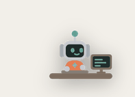
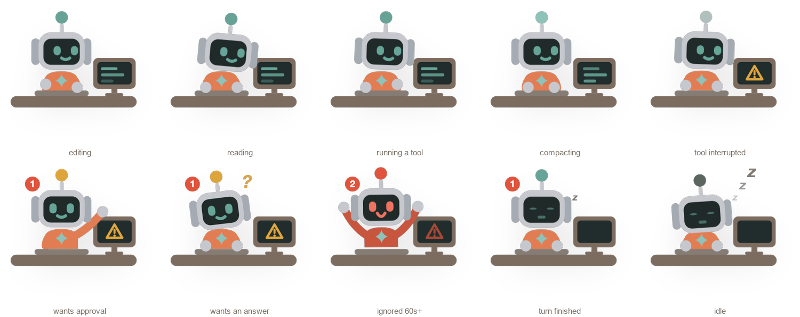

# Claude Pet

**English** · [中文](README.zh-CN.md)

[](https://github.com/ZephTu/claude-pet/actions/workflows/ci.yml)

A little robot that sits on your macOS desktop and shows, at a glance, what every Claude Code session on your machine is doing.



You stop tabbing through terminal windows to find out which session finished and which one is stuck waiting for you. It never makes a sound and never posts a system notification — it just changes in the corner of your eye.

## The lamp is the signal

The bulb on the antenna is the part you can read without focusing on it:



| Lamp | Meaning | What it does |
| --- | --- | --- |
| 🟢 slow blink | a session is working | heads down, typing, code scrolling on its monitor |
| 🟡 pulse | a session needs your approval | stops typing, turns around, waves — and its monitor switches to a warning |
| 🔴 fast blink | ignored for 60s+ | both arms up, jolting, bubble names the project **and the command it is blocked on** |
| ⚫ off | everything is done | asleep at the desk with z's drifting up |

## What you can do with it

**Click it** to expand the panel. It has three groups, in the order they want your attention:

- **Needs you** — sessions blocked on an approval or a question, longest wait first
- **Finished** — turns that ended while you were not looking, folded to one row per session
- **Running** — everything else that is alive

A number on the robot's chest counts both kinds of attention. It is not shown at zero.

**Drag** to move it; it remembers where you put it. Drag it near the left edge of a display and the whole layout flips — pet on the left, panel opening to its right — so the panel never runs off-screen. **Right-click the pet** for pause / reduce motion / connection status / demo / launch-at-login / quit. **Right-click a row** to name that session, pin it, see its recent activity, or mute it.

**Click a row marked ↗** to jump straight to the terminal tab that session is running in.

- **Orca** goes through its own CLI (`orca terminal switch`) and needs no system permission at all
- **iTerm2** goes through AppleScript, so the **first jump raises a macOS Automation prompt**; deny it and jumps fail silently afterwards
- Other terminals cannot be addressed — those rows have no ↗ and clicking them just closes the list

**Hover a row** for 0.45s and the bubble answers what the row has no space for: the full path and worktree, how full the context window is and on which model (with the statusline wired up), how long this turn has been going versus how long since anything happened at all, and the last tool call with its result. It used to show the session's name — which stopped being worth a hover once the first column started showing it.

**Hover the robot itself** for a second and it reports your quota as two meters — the five-hour and weekly windows side by side, each with a countdown. The bar turns amber past 60% and red past 85%, the same warning ramp the antenna lamp uses.

**A finished row** can be clicked to jump to that session — and only then is it marked read, because a jump that did not happen must not clear the one record that it happened at all. If its session has closed, the row says so and offers the ✓ instead. `clear` on the group heading marks them all.

**Finishes are recorded on disk, not inferred.** Claude Code's `Stop` hook writes one file per finished turn, so a turn that began and ended between two refreshes still shows up, and so does one that finished while the pet was keeping quiet. They are kept for 7 days or 500 rows, read ones discarded first; if unread ones ever have to go, the panel says how many.

**⏱ on a blocked row** postpones it for 5, 15 or 30 minutes. The row stays visible and says how much longer — this is not muting. The delay belongs to that one approval: if the session resolves it and blocks on a different one, the new one is not postponed. Sleeping through a delay replays nothing.

**Click the × at the end of a row** to mute that session. A muted session is not in the list and cannot affect the robot's mood — it can sit blocked on a permission prompt without making the robot wave. It comes back on its own **the next time you type into it**; there is nothing to remember to undo. The panel footer says how many are muted, and the right-click menu can unmute them all at once.

When a session finishes a round of work the pet says so immediately, naming that session — so you learn it came to rest without watching for it.

A session stays listed for as long as its process is alive, however long it sits idle. Liveness is a kernel query, not a timestamp heuristic — an open session that nobody has touched in an hour is still an open session.

**A row says what is running right now**, from the tool calls that have started and not reported back — `Bash npm test`, `Read PetLayout.swift`, or `3 tools running`. The age beside it is how long *that call* has been going, which is the number that answers "is this stuck?". Inside `busy` the figure's pose follows: reading leans at the screen, editing types, anything else sits back and waits.

**Optional: a global shortcut.** Off by default. Turn on ⌃⌥⌘J in the right-click menu to jump to whatever has been waiting longest. Claiming a system-wide chord uninvited is taking something that was not offered, so you have to ask for it — and if another app already owns it, the menu says so instead of quietly failing.

**Right-click → Connection Status** reports what is actually wired up, in five states rather than a tick and a cross: `OK`, `Not set up`, `Not supported`, `Needs attention`, `Unknown`. The distinction matters — "you never turned this on" and "this broke" look the same to a cross and mean opposite things. Copy gives you a pasteable summary with your home directory collapsed to `~`; it describes the plumbing and never what you were working on. The check is read-only — it never edits `settings.json`.

**Right-click → Demo the States** cycles the pet through everything it can show, writing nothing to disk.

## Requirements

- macOS 14 or newer
- [Claude Code](https://claude.com/claude-code) installed
- A Swift toolchain (Xcode Command Line Tools) to build from source

Optional: the [claude-hud](https://github.com/jarrodwatts/claude-hud) statusline plugin. The pet reads the usage cache that plugin maintains rather than calling Anthropic's usage API itself — no OAuth token handling, no rate limit of its own. Without it, everything works except the quota readout.

## Install

```bash
./scripts/install.sh
```

Builds the working copy and installs it. No jq, no Python — just the Swift toolchain.

**This edits `~/.claude/settings.json`**, appending nine hooks (`SessionStart`, `UserPromptSubmit`, `PreToolUse`, `PostToolUse`, `Notification`, `PermissionRequest`, `PreCompact`, `Stop`, `SessionEnd`). Your existing hooks are not touched — not one byte. The file is backed up first, written atomically, parsed back to verify, and restored from the backup on any doubt. That file drives every Claude Code session on the machine, so it is the highest-risk thing here; keep the backups.

Hooks only take effect in **newly started** sessions. Windows already open are unaffected.

## What it touches

Three places, all reversible by `./scripts/uninstall.sh`:

1. `~/Applications/ClaudePet.app` — the pet itself
2. `~/.claude/pet/` — the hook binary and the data below
3. `~/.claude/settings.json` — nine appended hooks

Inside `~/.claude/pet/`:

| Path | What it holds | Cleared |
| --- | --- | --- |
| `sessions/<id>.json` | the CURRENT state of one session: project, directory, state, running tool calls, pid, timestamps | when the session ends |
| `events/<id>~<turn>.json` | one record per finished turn | 7 days, or 500 rows |
| `activity/<id>.jsonl` | that session's recent tool calls: tool, short target, duration, result | when the session ends, or `Clear History` |
| `read.json` | which finished turns you have acknowledged | with the events they refer to |
| `usage.json` | quota numbers, only if you wired up the statusline below | overwritten each time |

Aliases, pins, mutes, snoozes and settings live in `UserDefaults`, not here.

**It does not read your conversations, and it makes no network requests of any kind.** The activity log stores a deliberately incomplete summary of each command: the program name, then following words only up to the first one that could be carrying a value. `npm test` survives whole; `curl -H Authorization:Bearer …` becomes `curl …`. That is an allow-list by structure, not a denylist of words like "token" — a secret nobody thought to name is withheld too.

## Optional: reading quota from your statusline

The pet reads [claude-hud](https://github.com/jarrodwatts/claude-hud)'s cache if you have it. If you do not, and you are on Claude Code 2.1.251 or newer, it can capture the numbers from whatever statusline you already run:

```jsonc
// ~/.claude/settings.json — edit this by hand
"statusLine": {
  "type": "command",
  "command": "$HOME/.claude/pet/pet-emit --statusline -- <your existing command>"
}
```

`pet-emit --statusline` passes the input through byte for byte and forwards your command's output and exit code unchanged; a parse failure costs a quota reading and nothing else.

**The installer will not do this for you, on purpose.** A statusline command is arbitrary shell you wrote — this author's is a `bash -c` with three levels of nested quoting — and rewriting one in place without ever getting it wrong is not a bet worth taking for an optional feature. It also means uninstalling the pet cannot break a statusline it never touched.

Wiring this up also gives each row a **context-window percentage**, the model's name and the session's `/rename` name — none of which reaches a hook. Hover a row to see them, along with the full path, the turn's age and the last tool call.

Two sources are never blended. Whichever reading is fresh wins; a stale reading from a better source still describes a window that may have rolled over.

## Uninstall

```bash
./scripts/uninstall.sh
```

Removes the hooks, the app and the launch agent. `settings.json` returns to exactly what it was.

## Sending it to someone else

```bash
./scripts/package.sh
```

Produces two tarballs: one with a precompiled universal binary and a one-click installer, needing no developer tools on the receiving end, and one with just the source.

## Development

```bash
swift run ClaudePetTests     # unit tests — not `swift test`, see below
./hooks/test-pet-emit.sh     # hook behaviour tests
./hooks/test-settings-patch.sh  # settings.json round trip — see below
./scripts/build-app.sh       # build ClaudePet.app without installing
```

Tests run through a small hand-written harness as an executable target rather than XCTest: with only the Command Line Tools installed (no full Xcode), **neither XCTest nor swift-testing is available**, so `swift test` cannot run at all.

To watch all four states animate, serve the repo (`python3 -m http.server 8777`) and open
`http://127.0.0.1:8777/docs/previews/`. That page frames the real `Resources/pet/index.html`
rather than keeping a copy, so it cannot fall behind the app.

The design document in `docs/superpowers/specs/` explains the architecture and, more usefully, why each piece is the way it is. **It is written in Chinese** — the code, comments and this README are English, but that document has not been translated.

### Three things worth knowing before you change anything

**The hit region is two rectangles in `Sources/ClaudePetCore/PetLayout.swift`, and they must agree with the drawing in `Resources/pet/pet.css`.** Change the art and you must change `PetLayout`, and the other way round. No test can catch a mismatch — they can only lock the Swift half — so this is a convention, not a guardrail.

This is not hypothetical. The mirrored layout was first written as a reflection (`x → width - maxX`), every test passed, and the body box still looked right in a screenshot — because it happens to be symmetric inside the pet. The antenna's box is not, and the bulb ended up outside its own hit region. What caught it was drawing both rectangles over the rendered page and looking. Do that after any change here.

**The `settings.json` patch is tested against real files, not in process.** It is the only thing here that can break someone else's machine, and the parts that make it safe — the backup, the atomic write, the parse-back, the rollback — exist only on disk; testing them in memory tests nothing. The assertion that matters is the round trip: install then uninstall, and not one field of the user's own hooks may differ.

**Terminal jumping is split in two on purpose.** Everything testable — identifying the terminal, parsing session ids, rejecting AppleScript injection — lives in `Sources/ClaudePetCore/TerminalTarget.swift`. The part that actually spawns processes is in `Sources/ClaudePet/TerminalJump.swift`.

## Known limitations

- No Apple Developer signature. The installer strips the quarantine attribute and says so; Gatekeeper may still need a manual allow.
- Click-through is computed from two rectangles, not the figure's outline, so a few transparent pixels near the robot still swallow clicks.
- Roughly **0.9% CPU and 63MB** while idle, measured on an M-series Mac by CPU-time delta over 20s. That figure did not move when the session count went from 4 to 14, and **Reduce Motion did not lower it either** (0.8% vs 0.9%, inside the measurement noise) — the CSS animation is composited and costs almost nothing. Reduce Motion is there for people who do not want movement on their desktop, not as a way to save power.

## License

MIT — see [LICENSE](LICENSE).
