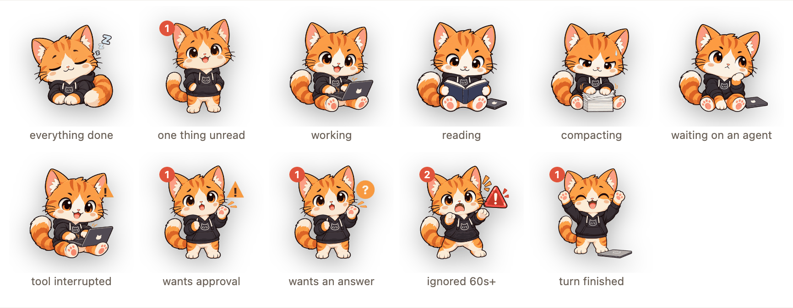

# Claude Pet

[English](README.md) · **中文**

一只常驻 macOS 桌面的猫，坐在电脑前，用动作反映本机全部 Claude Code session 的聚合状态。


宠物几乎每个状态猫都有一张自己的图，这就是用它的理由——一个姿势隔着屏幕余光扫过去就读到了，不用停下来数。机器人也还在，它保住了猫画不出来的那个区分，**右键 → Appearance** 可以换，下面讲形象那段写了各自能说什么、不能说什么。



按它要你多少事排，从睡着开始：

| 状态 | 你看到什么 |
|---|---|
| 全都停了 | 蜷着睡着，头顶飘 zzz |
| 有一轮结束了还没人看 | 醒着站起来，耳朵边上那个数字还留着。和睡着是两张图——机器人只有一张休息姿势，这个区分它做不出来 |
| 有 session 在干活 | 趴在 laptop 前敲键盘。**改文件和等命令跑完是同一张图**，要分开这两个得用机器人 |
| 在读代码 | 双爪捧着书，鼻子快贴上去了 |
| 正在压缩上下文 | 在整理一摞纸。也是在干活，只是干的不是你要的那件 |
| 在等后台 agent | 爪子托着下巴，laptop 推到一边。Claude 派了个后台 agent 就把这一轮结束了，等 agent 跑完它自己会再开口。**这一轮不报完成**——什么都没完成，这时候走过去只会看到一个还没开始的 session |
| 工具被打断 | 猫身上多一个警告三角，人继续干活——一次工具失败通常不等于任务失败 |
| 有 session 等你授权 | 举起一只爪子，旁边一个警告三角，每五秒闪两下，免得它杵在那没人看见 |
| 有 session 等你回答 | 还是那只举起的爪子，三角换成问号。这个要的是你打字，不是一个决定 |
| 等超过 60 秒 | 后腿站起来在叫，旁边是它自己那个红色警报，气泡写出是哪个 project **以及卡在哪条命令上** |
| 刚干完一轮 | 双爪举起来欢呼一下。做得短是故意的：一轮结束只说明它不说话了，不说明活干对了 |

点它展开面板。面板按「谁更需要你」分三组：

- **需要你** — 卡在授权或提问上的 session，等最久的排最前
- **刚结束** — 你没看着的时候结束的那些轮，同一个 session 折叠成一行
- **在跑** — 其余还活着的

每个组标题后面跟着自己那组有几条；只有一个Running组的时候标题就不画了，反正下面的行就是全部。

需要你那组的行会写清楚是哪种打断——**Needs approval**还是**Awaiting reply**——左边还有一条暖色竖条，等太久（超过宠物自己那个红徽章的阈值）就转红。第二行放的是你要批的那条命令（`rm -rf build/`），不再是hook自己那句Claude is waiting for your input：以前三行卡住就把同一句话印三遍，而每行的第一行本来就已经说了它在等你。

这两类加起来是一个数字，机器人画在胸前，猫画在耳朵边上，为零时不显示。

「在跑」里有一行 90 秒没吭声、也没有工具在飞的话，会变成**空心点 + No recent activity**，并且不再算 busy——宠物会因此睡过去，也不会说这一轮结束了。这种基本都是你按 Esc 取消掉的那一轮：打断的时候 Claude Code 一个 hook 都不发，最后写进去的 `busy` 就一直留着，没有任何东西来把它改回去。这里故意不写「done」，因为宠物根本无从知道那轮到底做完没有；那个 session 只要再有任何动静，这行立刻恢复正常。

拖它换位置，它记得你放哪。拖到屏幕左边缘附近整个布局会翻过来——宠物到左边、面板从它右边开——这样面板不会跑出屏幕。**右键宠物**：面板常驻 / 暂停 / 低动态 / 鼓励与休息提醒 / 连接状态 / 演示 / 开机启动 / 退出。勾上 **Keep List Open** 面板就一直挂着，点宠物不收、跳终端也不收，没有 session 的时候也照常占着那块地方——代价是那块区域会一直吃鼠标事件，点不到底下的东西，想让开就去菜单取消勾选。**右键某一行**：给这个 session 起名、置顶、看最近活动、静音。

不发系统通知、不出声。

**点列表里带 ↗ 的行，直接跳回那个 session 所在的终端标签页。** 支持 Orca 和 iTerm2：

- **Orca** 走它自带的 CLI（`orca terminal switch`），不需要任何系统权限
- **iTerm2** 走 AppleScript，**第一次跳转会弹一次 macOS 自动化授权**，拒绝之后就静默失效
- 其他终端认不出来，那些行不带 ↗、点了只会展开/收起面板

某个 session 干完一轮活，宠物会立刻说出是哪一个——你不用盯着也知道它停下来了。

**有两句话是关于你，不是关于活儿的。** 每天第一个 session 起来的时候，宠物从 `Resources/pet/quotes.json` 里挑一句说，按天数取，所以一整天都是同一句、明天换一句。连续在工位两小时没歇，它让你起来走走、接杯水、或者看看窗外，之后每四十五分钟再念一次。两条默认都关，**右键 → Encouragement & Breaks** 一起打开。宠物别的话都是在报你自己起的活儿，对你的早晨发表意见不是它能自己拿的东西。

两件事让它不至于变成所有健康提醒最后都会变成的那种背景噪音。一是它们**排在最后**——宠物只要有关于你活儿的话要说，就轮不到它们，session 跑完永远抢得到气泡。二是那两小时是**观测出来的，不是倒数出来的**：时钟跟着 session 自己的活动走，半小时没动静这一轮就算结束，早上没碰过的机器对你的早上没有发言权。它是故意往少了算的——看代码不跑 Claude 跟出去吃饭在它眼里长得一模一样，提醒来晚一次，好过对着空椅子喊起来活动活动。

**宠物不发任何网络请求。** 这些句子是手写手筛的，`scripts/fetch-quotes.py` 是开发机上用来补充语料的工具——2026 年 9 月实测了一圈免费的名言 API，没有一个能保证早上九点递给你一句又短又不别扭的话。

**点「刚结束」里的行**可以跳到那个 session，**跳成功之后才标已读**——没跳成的跳转不能把「这件事发生过」的唯一记录抹掉。会话已经关掉的行会说明这一点，改成给你一个 ✓。组标题上的 `clear` 是全部已读。

**完成记录是落盘的，不是推算的。** Claude Code 的 `Stop` hook 每结束一轮写一个文件，所以两次刷新之间开始又结束的那一轮照样能看到，宠物正在安静时结束的那一轮也是。保留 7 天或 500 条，先丢已读的；万一非丢未读不可，面板会说丢了几条。

**一轮结束不等于活干完了。** 派个后台 agent 出去，Claude 当场就把这一轮结束了——终端上写着 `Waiting for 1 background agent to finish`，而宠物会在真有东西看的九分钟之前就给它点上红点。`Stop` 的 payload 里带 `background_tasks`，所以还挂着 agent 或 workflow 的那一轮记成「暂停」：session 照样算在跑，行上写清在等什么，等 agent 唤醒的那一轮才算真的干完。后台 **shell** 不算挂着——Claude Code 自己那句 waiting 计数就不算它，否则你挂一个 dev server 在后台跑一下午，这个 session 一整个下午都不会再报完成。

**卡住的行上有个 ⏱**，点它推迟 5 / 15 / 30 分钟。那行还在、还在「需要你」组里、还写着「later — 12m」——这不是静音。推迟挂在**那一次授权**上：这个解决了又卡在另一个上，新的那个不继承延期。合盖睡一夜醒来不会集中补弹。

session 只要进程还活着就一直列在上面，不管多久没动静——存活是查进程，不是看时间戳。

**每行会写出它此刻在跑什么**：`Bash npm test`、`Read PetLayout.swift`，或者「3 tools running」。旁边那个时间是**这一次调用**跑了多久——那才是回答「它是不是卡住了」的数字。busy 内部姿势也跟着变：读的时候凑近屏幕，改的时候敲键盘，等别的东西的时候慢下来看着。等授权和等你回答长得不一样：前者举手，后者歪头加一个问号。

**可选的全局快捷键**，默认关闭。右键菜单里打开 ⌃⌥⌘J，跳到等最久的那个。桌面挂件第一次运行就占掉一个系统级组合键，是拿了没人给的东西，所以要你自己开——被别的 app 占了菜单会说出来，不会假装打开了。

**右键 → Connection Status** 报告实际接通了什么，用五档而不是对错两档：`OK` / `Not set up` / `Not supported` / `Needs attention` / `Unknown`。这个区分是有意义的——「你从没开过这个」和「这个坏了」在一个勾一个叉里长得一模一样。Copy 给你一份能直接贴的摘要，home 目录折成 `~`；它只讲管道，不讲你在干什么。自检只读，不会去改 `settings.json`。它也不抢键盘焦点，你正在打的字不会被打断。

**右键 → Appearance** 换一个形象，内置两个。

**Cat** 是默认：手绘贴图挂在 WebGL 形变网格上，尾巴会摆、会眨眼、眼珠会动，耳朵每几秒抖一下。它有九张图对宠物的十一个状态——读代码、压缩上下文、等后台 agent 各有各的图，干完一轮是专门画的欢呼而不是把 idle 那张弹一下。还压在一起的是 busy 里剩下的部分：改文件和等命令跑完是同一只猫趴在同一台电脑前。举爪加 `?` 是「等你回答」，加警告三角是「等你授权」，这个符号每五秒放大两下，免得你一直没看见；被晾久了那张贴图自带红色警告；工具被打断是一只照常干活的猫顶个警告三角。未读数在耳朵边上。

**Robot** 是一张 SVG，每个状态就是一条 CSS 规则。它保留了猫做不到的一件事：天线上那颗灯加上姿势能分开**每一个** busy 状态，包括改文件和等命令跑完。你要是更看重这个区分而不是画风，就选它。


选了哪个会记住。WebGL 跑不起来、或者贴图解不开，页面自己退回机器人并告诉 app——不然命中区域会属于一个根本不在屏幕上的形象；这也是兜底退的是机器人不是猫的原因。

**右键 → Demo the States** 把宠物能显示的十种状态过一遍，一个字节都不落盘。

行首那个名字按「你起的别名 > 有意义的终端标签标题 > 目录名」选，都按 sessionId 存——同一个目录下三个 session 是三件事，按路径存会让一个拿到另一个的名字。第二行只在**第一列显示的不是标题**时才补上标题，不然就是同一个名字上下各印一遍。分支名也在第二行，`main` 和 `master` 不显示（那是噪音）。

**鼠标停在某一行 0.45 秒**，气泡回答这一行放不下的东西：完整路径和 worktree、context 用了多少、跑在哪个模型上（要接了 statusline）、这一轮跑了多久 vs 距离上次有动静多久，以及最后一次工具调用和它的结果。以前这里显示的是 session 名字——第一列开始会显示名字之后，那就不值一次 hover 了。

**停在宠物身上 1 秒**，气泡把额度画成两条进度条——五小时和一周并排，各带倒计时。超过 60% 变黄、超过 85% 变红，和这里其他地方是同一套预警色。

**不想看某个 session**：鼠标移到那一行，行尾出现 ×，点它静音。静音的 session 既不在列表里，也不会影响宠物表情（它卡在等授权也不会让宠物举手）。**下次你在那个 session 里敲字，它自动回来**，不用手动取消。面板底部会写着还静音着几个，右键菜单可以一次性全部取消。

## 安装

```bash
./scripts/install.sh
```

编译当前工作副本并装到本机。不需要 jq、不需要 Python，只要有 Swift 工具链。

额度播报依赖 [claude-hud](https://github.com/jarrodwatts/claude-hud) 这个 statusline 插件——宠物读的是它维护的 usage 缓存，而不是自己去调 Anthropic 的 usage API，所以不碰你的 OAuth token、也不占你的 rate limit。没装那个插件的话，除了额度以外一切照常。

**这个脚本会改你的 `~/.claude/settings.json`**：往 hooks 里追加九条 `pet-emit`（SessionStart / UserPromptSubmit / PreToolUse / PostToolUse / Notification / PermissionRequest / PreCompact / Stop / SessionEnd），已有的 hook 一条不动、一个字节不改。备份、原子写、写完解析校验、出问题回滚都在 `pet-emit --patch-settings` 里做。settings.json 写坏了本机所有 session 都受影响，这是整个项目风险最高的一步，所以备份别删。

装完要开一个新的 Claude Code session 才会生效，已经开着的不受影响。

## 它在你机器上放了什么

`~/.claude/pet/` 里：

| 路径 | 存什么 | 什么时候清 |
| --- | --- | --- |
| `sessions/<id>.json` | 一个 session **当前**的状态：项目、目录、状态、在飞的工具调用、pid、时间戳 | session 结束时 |
| `events/<id>~<turn>.json` | 每结束一轮写一条 | 7 天，或超过 500 条 |
| `activity/<id>.jsonl` | 这个 session 最近的工具调用：工具、简短目标、耗时、结果 | session 结束时，或手动 Clear History |
| `read.json` | 哪些完成记录你已经看过了 | 跟着它指向的记录一起清 |
| `usage.json` | 额度数字，只在你按下面接了 statusline 时才有 | 每次覆盖 |

别名、置顶、静音、延后和各项设置在 `UserDefaults` 里，不在这儿。

**它不读你的对话，也不发任何网络请求。** 活动记录里的命令是**故意不完整**的摘要：程序名，后面的词只放行到第一个可能带值的东西为止。`npm test` 原样保留，`curl -H Authorization:Bearer …` 变成 `curl …`。这是按结构放行，不是按「token」「password」这种词去黑名单——没人想到要命名的 secret 一样拦得住。

## 可选：从你的 statusline 读额度

装了 claude-hud 的话宠物直接读它的缓存。没装、而且你的 Claude Code 是 2.1.251 以上，可以让它从你已有的 statusline 里把数字捞出来：

```jsonc
// ~/.claude/settings.json —— 手动改这里
"statusLine": {
  "type": "command",
  "command": "$HOME/.claude/pet/pet-emit --statusline -- <你原来的命令>"
}
```

`pet-emit --statusline` 把输入逐字节转发，你原来那条命令的输出和退出码原样透传；解析失败只损失一个额度读数。

**安装脚本不会替你改这个，是故意的。** statusline 命令是你自己写的任意 shell——作者本机那条是套了三层引号的 `bash -c`——原地重写它而永不出错，不是一个值得为可选功能下的注。这也意味着卸载宠物不可能弄坏一个它从没碰过的 statusline。

接上之后每一行还多出 **context 占用比例**、模型名字和这个 session 用 `/rename` 起的名字——这三样 hook 都拿不到。停在某一行上就能看到。

两个来源永不混合。新鲜的那个赢，因为一个更权威但过期的读数描述的是可能已经翻篇的窗口。

## 卸载

```bash
./scripts/uninstall.sh
```

摘掉 hook、删掉 app 和开机自启的 plist，`settings.json` 回到装之前的样子。

## 发给别人

```bash
./scripts/package.sh
```

产出两个包：`dist/claude-pet-<版本>.tar.gz` 带预编译 universal 二进制和一键安装脚本，收件人不需要任何开发工具；`dist/claude-pet-<版本>-src.tar.gz` 是纯源码。

## 开发

```bash
swift run ClaudePetTests     # 单元测试（不是 swift test，本机没装 Xcode）
./hooks/test-pet-emit.sh     # hook 行为测试
./hooks/test-settings-patch.sh  # settings.json 往返测试，见下
./scripts/build-app.sh       # 只打包 ClaudePet.app，不安装
```

`PET_DUMP=/tmp/hooks.jsonl claude` 会让 hook 程序把收到的每个 payload 原样追加到这个文件，
不设这个变量就什么都不做。这是调试工具不是功能——payload 里带着 prompt 原文——但想知道某个
hook 到底发了什么，只有这一条老实路子。这里靠猜错过不止一次：早先那版额度解析列了五种它觉得
可能的字段拼法，恰好漏掉真的那个，于是什么都没读到，README 上还写着「未验证」。

想看所有状态动起来：在仓库根目录跑 `python3 -m http.server 8777`，然后开
`http://127.0.0.1:8777/docs/previews/`。旁边的 `cycle.html` 就是 README 那张动图的来源。
两个页面都是直接把真的 `Resources/pet/index.html` 嵌进去、不另存一份，而且上面那两张图
也都从这两个页面截出来——一件事只留一份产物，文档才不会比代码少一个状态，上一版的状态图
就是这么漏掉的。

设计文档在 `docs/superpowers/specs/`，讲清楚了架构，以及每个地方为什么是现在这样。

终端跳转的逻辑分两半：能纯粹测的（识别终端、解析 session id、防 AppleScript 注入）在 `Sources/ClaudePetCore/TerminalTarget.swift`，真正执行跳转的在 `Sources/ClaudePet/TerminalJump.swift`。

`settings.json` 的补丁测试跑的是真文件，不是进程内单测。因为这是这个项目唯一能把别人机器搞坏的地方，而它危险的部分——备份、原子写、写完解析回读、出事回滚——全都只存在于磁盘上，在内存里测等于没测。断言里最要紧的一条是往返：装上再卸掉，用户自己的 hook 一个字段都不能变。

宠物的点击命中区是 `Sources/ClaudePetCore/PetLayout.swift` 里的两个矩形，和 `Resources/pet/pet.css` 的画面必须对齐——**改了画面就要改 PetLayout，反之亦然**。这一点没有测试能替你发现（测试只能锁住 Swift 那一半），只能靠这条约定。

这不是假设。镜像布局第一版写成整窗反射（`x → width - maxX`），测试全绿、截图里 body 框也罩得好好的——因为它在 pet 元素里恰好左右对称。天线框不对称，灯泡直接跑到自己的命中区外面去了。抓到它的办法是把两个框画到渲染出来的页面上看一眼。这里改完就这么验一次。

## License

MIT，见 [LICENSE](LICENSE)。
